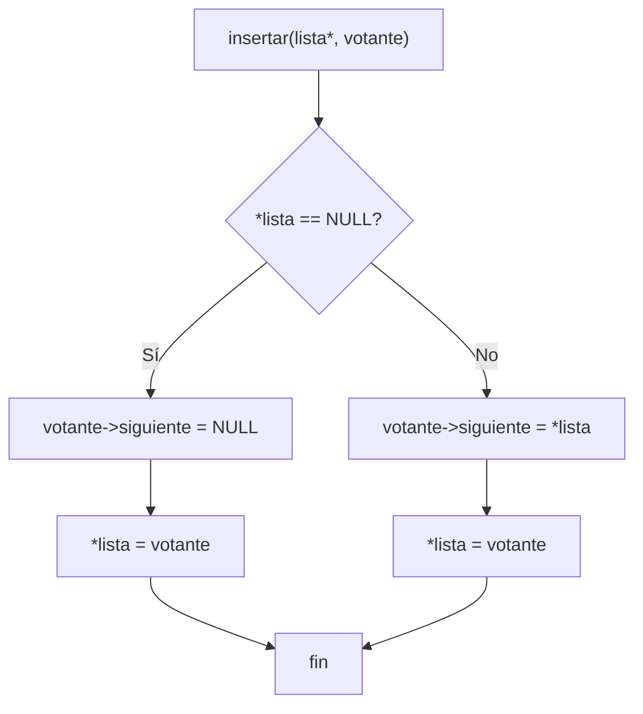

```mermaid
flowchart TD
  A["insertar(lista*, votante)"] --> B{"*lista == NULL?"}
  B -- "Sí" --> C["votante->siguiente = NULL"]
  C --> D["*lista = votante"]
  B -- "No" --> E["votante->siguiente = *lista"]
  E --> F["*lista = votante"]
  D --> G["fin"]
  F --> G["fin"]
```
